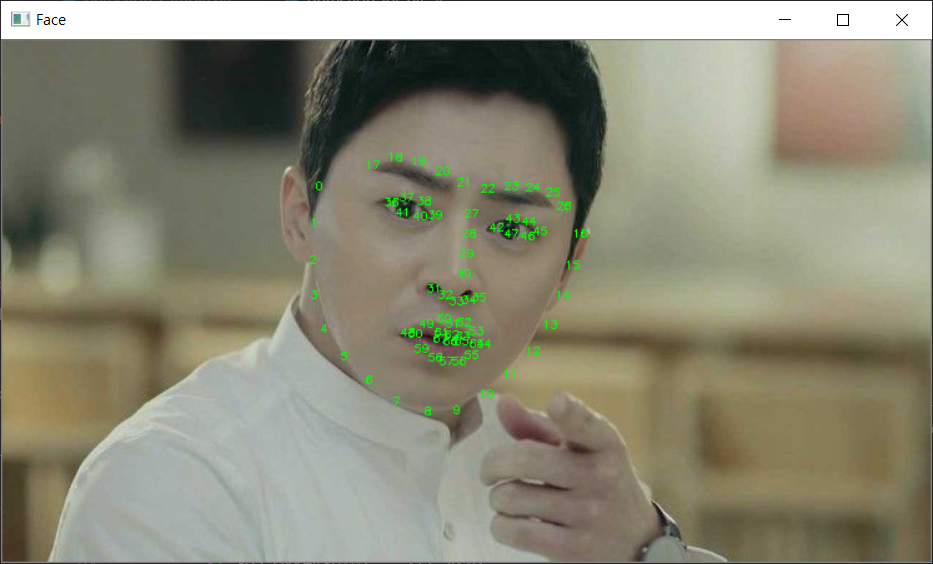
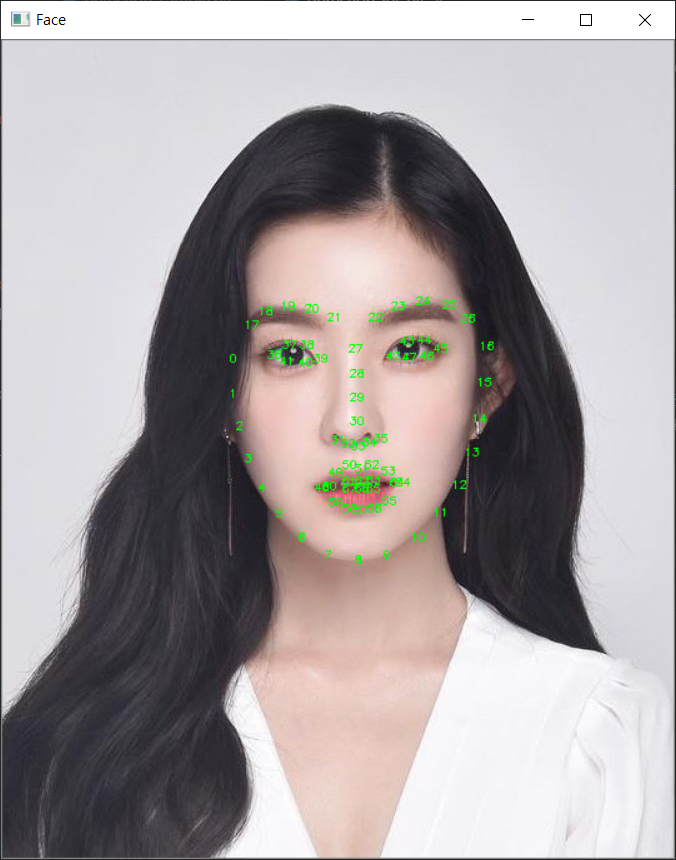

# 어이관상가양반

기획부문

| QA              | 기획           |
| --------------- | -------------- |
| 박해제,  이호진 | 조수장, 김현종 |

개발부문

| 개발                           | 팀원   |
| -------------------------------| ------ |
| 앱 카메라 관련 기능개발        | 박해제 |
| 하이브리드 앱 레이아웃 구현    | 이호진 |
| Django Rest API               | 김현종 |
| 관상 알고리즘 구현 및 영상처리 | 조수장 |

조수장 (영상처리)

# 앱 실행하기 
## Down load project

    git clone https://lab.ssafy.com/s1-final/s1p2151002.git

### front 최상위 폴더에서 node modules 받는다

    cd Front/face
    npm install

## cordova plugin, platfom 설정한다.

    cd src-cordova
    cordova prepare

## 앱 실행에 필요한 환경을 확인한다.

    cordova requirements

ex) 안드로이드 

- Java Development Kit (JDK)
- Gradle
- Android SDK

[https://cordova.apache.org/docs/en/latest/guide/platforms/android/index.html](https://cordova.apache.org/docs/en/latest/guide/platforms/android/index.html)

## 프로젝트를 실행한다.

일반 버전

    cordova run andorid

개발 버전 ( 코드 수정시 즉시 화면 변경)

front 최상위 디렉토리에서 실행

    cd ..  // Front/face 에서 실행
    npm run cordova-serve-android
    
# 백 프론트 요청

    
    사전 dictionarys
    
    사전 데이터
    $.ajax({
        type : "GET",
	    url : "http://192.168.31.107:8000/api/dictionarys/",
	    data : {
		    types : 'NOSE' //MOUSE, EYE, EYE_BROW
	    },
        success: function(data){
		    console.log(data)
		}
    })
    
    return 사전 data
    data = {
        number //숫자
        title 
        positive
        negative 
    }
    
    사전 이미지
    "http://192.168.31.107:8000/api/media/dictionarys/EYE/1.jpg" //number.jpg
    "http://192.168.31.107:8000/api/media/dictionarys/EYEBROW/1.jpg"
    "http://192.168.31.107:8000/api/media/dictionarys/NOSE/1.jpg"
    "http://192.168.31.107:8000/api/media/dictionarys/MOUSE/1.jpg"
    
    얼굴 이미지 post
    var formData = new FormData();
	var temp = $('input[name=uploadimage]')[0].files[0];
	console.log(temp)
	formData.append('image', $('input[name=uploadimage]')[0].files[0]); 
		
	$.ajax({
		type : "POST",
		url : "http://192.168.31.107:8000/api/faces/",
		processData: false,
            contentType: false,
		data : formData,
		success : function(data){
			console.log(data)
		}
	})
	
	return 얼굴 data
	data = {
        name //random값
        eye 
        eye_brow
        nose
        mouse
    }
    
    
    
    
    얼굴 이미지
    http://192.168.31.107:8000/api/media/name/name_face.jpg //_nose.jpg, _mouse.jpg, _eyebrow, _origin
    
    
    
	
	